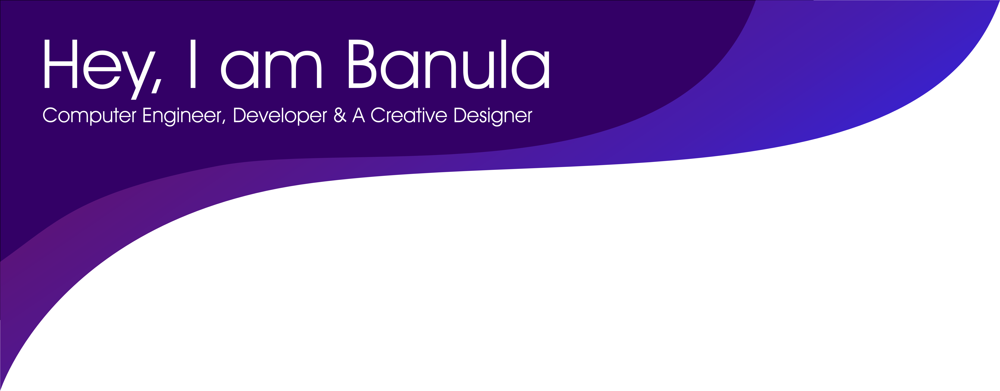

<div align="center">
  
  
  <h1 align="center">Hi there, I'm Banula Lakwindu 👋</h1>
  
  <p align="center">
    <a href="https://git.io/typing-svg">
  
</a>
  </p>

  <p align="center">
    
    <a href="https://github.com/banulalakwindu">
      
    </a>
  </p>
</div>

---

## 👨‍💻 About Me

- 🔭 **Currently working on:** Scalable web applications, cloud-based solutions, and university research projects
- 🌱 **Learning:** Advanced Laravel, Serverless Architecture on AWS, and modern fullstack frameworks like Next.js
- 👯 **Open to collaborate on:** Innovative web projects, cloud-native applications, and open-source contributions
- 💬 **Ask me about:** PHP, Laravel, JavaScript (React, Node.js), AWS, and fullstack development best practices
- 📫 **Contact:** [banulalakwindu10@gmail.com](mailto:banulalakwindu10@gmail.com)
- ⚡ **Fun fact:** I enjoy blending coding sessions with gaming and music — keeps the flow alive 🎮🎵

---

## 🚀 Published Packages

<div align="center">
  <h3>My Open Source Contributions</h3>
</div>

### 📦 Laravel Column Helpers
A Laravel package providing useful traits and migration macros for common model columns.

```bash
composer require banulalakwindu/laravel-column-helpers
```

[](https://packagist.org/packages/banulalakwindu/laravel-column-helpers)
[](https://packagist.org/packages/banulalakwindu/laravel-column-helpers)

### 🛠️ VVECON Setup Package
A powerful CLI tool to automate the setup process for VVECON projects.

```bash
npm install -g vvecon-setup
```

[](https://www.npmjs.com/package/vvecon-setup)
[](https://www.npmjs.com/package/vvecon-setup)

---

## 🌐 Connect With Me

<div align="center">
  <a href="https://twitter.com/BanuLakwindu" target="blank"></a>
  <a href="https://linkedin.com/in/banulalakwindu" target="blank"></a>
  <a href="https://facebook.com/banula.lakwindu" target="blank"></a>
  <a href="https://instagram.com/__banu__lakwin__" target="blank"></a>
</div>

---

## 🛠️ Tech Stack

### Programming Languages
<div align="center">


</div>

### Web & Frameworks
<div align="center">


</div>

### Databases & Tools
<div align="center">


</div>

### Cloud & DevOps
<div align="center">


</div>

<div align="center">
  
</div>

